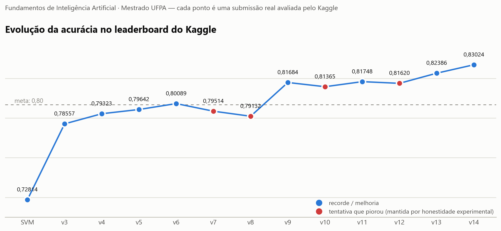

# Classificação de Gêneros Musicais — Documentação da Solução (para o seminário)

**Competição:** Kaggle da disciplina de Fundamentos de Inteligência Artificial (Mestrado, UFPA), criada pelo professor — dataset derivado do desafio ISMIS 2011 (Music Information Retrieval)
**Tarefa:** classificar segmentos de música em 6 gêneros (Blues, Classical, Jazz, Metal, Pop, Rock) a partir de 191 features de áudio pré-extraídas.
**Resultado final: 0,83024 de acurácia no leaderboard — 1º lugar** (partimos de 0,72814).

---

## 1. O problema em uma frase

Cada linha dos dados é um **trecho de uma música** (12.495 no treino, 5.225 no teste). O detalhe que definiu todo o projeto: **não existe identificador de música**, as linhas estão embaralhadas, e **o teste vem de gravações e intérpretes diferentes do treino**.

---

## 2. O placar da jornada

| Versão | Ideia central | Leaderboard | Veredito |
|---|---|---|---|
| K-Means (v1/v2) | não supervisionado, voto por cluster | — (85,9% local) | linha de base |
| SVM | melhor de 7 modelos supervisionados | **0,72814** | 💥 choque: 97,6% local |
| v3 | features DCT + pseudo-rotulagem | 0,78557 | ✓ |
| v4 | + correção de *label shift* (EM) | 0,79323 | ✓ |
| v5 | + cotas por classe na seleção | 0,79642 | ✓ 1º lugar |
| v6 | + bagging de 4 execuções | 0,80089 | ✓ meta 0,80 |
| v7 | suavizar previsões por clusters | 0,79514 | ✗ |
| v8 | + 16 features de geometria espectral | 0,79132 | ✗ |
| v9 | **consenso de música na seleção de pseudo-rótulos** | 0,81684 | ✓✓ +1,6 p.p. |
| v10 | consenso em clusters mais grossos | 0,81365 | ✗ |
| v11 | 2ª passada do laço (realimentação) | 0,81748 | ✓ |
| v12 | média v9+v11 | 0,81620 | ✗ |
| v13 | clusters kNN-mútuo + peso maior + 8 membros | 0,82386 | ✓✓ |
| v14 | fração de incorporação 0,85 → 0,90 | **0,83024** | ✓✓ final |

<picture>
  <source media="(prefers-color-scheme: dark)" srcset="assets/leaderboard_evolucao_dark.png">
  
</picture>

---

## 3. As etapas, do jeito que aconteceram

### Etapa 1 — K-Means (não supervisionado)
- **Como:** ~24 features de engenharia (agregados/inclinação das bandas espectrais, razões grave/agudo) + log com sinal nas colunas assimétricas + winsorização (0,5%/99,5%) → StandardScaler → PCA 95% → K-Means com k=300, cada cluster prevê seu gênero majoritário.
- **Resultado:** 85,9% na validação. Serviu de linha de base e o pré-processamento foi reaproveitado em tudo depois.

### Etapa 2 — Supervisionado (o choque)
- **Como:** 7 modelos comparados com o mesmo pré-processamento (sem PCA). **SVM RBF (C=10) venceu com 97,60%** na validação cruzada (estável, ±0,24%).
- **Resultado no Kaggle: 0,72814.** 25 pontos abaixo do local.

### Etapa 3 — O diagnóstico (validação adversarial)
- **Como:** junte treino + teste, crie o rótulo binário "é do teste?" e treine um classificador. Se as distribuições fossem iguais, AUC ≈ 0,5. **Deu 0,97** → *covariate shift* severo.
- **O que descobrimos:** as features que separam treino de teste são de **timbre/condição de gravação** (MFCC2, bandas altas ASE/SFM). E como vários segmentos vêm da mesma gravação sem ID, qualquer validação local vaza: o modelo "reconhece a gravação", não o gênero. **Nenhuma métrica local é confiável — o leaderboard virou o único juiz.**

### Etapa 4 — v3: atacar o shift (DCT + pseudo-rotulagem)
- **Features DCT:** aplicar a Transformada Discreta de Cosseno ao longo das bandas espectrais (o mesmo princípio dos MFCCs) comprime a **forma** do espectro — característica do gênero — em 40 coeficientes menos sensíveis à gravação.
- **Pseudo-rotulagem (self-training):** prever o teste, incorporar as previsões mais confiantes como exemplos de treino (com peso reduzido), re-treinar, repetir. O modelo "aprende com o próprio teste".
- Ensemble: SVM (0,6) + HistGradientBoosting (0,4). **→ 0,78557**

### Etapa 5 — v4/v5: corrigir as proporções (label shift)
- **Problema:** a proporção de gêneros no teste ≠ treino. **Correção EM de Saerens:** re-estimar iterativamente os priors do teste e reescalar as probabilidades (`P'(y|x) ∝ P(y|x)·π_novo/π_treino`).
- **Problema 2 (v5):** selecionar pseudo-rótulos só por confiança tem viés — a classe fácil (Classical) inunda o pool e a rara (Metal) colapsa de 1,9% para 0,8%. **Solução: cotas por classe** proporcionais aos priors estimados (alinhamento de distribuição, estilo FixMatch), com o EM aplicado **dentro de cada rodada**.
- Ensemble virou triplo: SVM (0,5) + HistGB (0,3) + LightGBM (0,2). **→ 0,79323 (v4) → 0,79642 (v5)**

### Etapa 6 — v6: bagging do processo inteiro
- **Como:** rodar o processo v5 completo 4 vezes (sementes, subamostras de 90% e hiperparâmetros diferentes) e tirar a **média das probabilidades** das 4 execuções.
- **→ 0,80089** (meta de 0,80 batida; 1º lugar)

### Etapa 7 — v7 e v8: as duas falhas que ensinaram o caminho
- **v7 (0,79514 ✗):** suavizar as previsões finais pela média dos "colegas de música" (clusters no espaço bruto). Tinha ganhado +1 p.p. na validação local mais cuidadosa que conseguimos montar — e **mesmo assim perdeu no teste real**. Lição: pós-processar a *saída* não transfere.
- **v8 (0,79132 ✗):** 16 features novas de geometria espectral (interpolação PCHIP + integração de Simpson + quantis por Newton-Raphson) — matematicamente sólidas e mais invariantes ao shift, mas **redundantes** com as DCT. Lição: mexer na *representação* de um pipeline no ótimo também não transfere.
- **A síntese das duas falhas:** neste problema, melhorias só transferiram quando entraram pela **seleção do que o modelo estuda** (os pseudo-rótulos) — nunca pela saída ou pelas features.

### Etapa 8 — v9: a virada (consenso de música na seleção) — +1,6 p.p.
- **A ideia:** os vencedores do desafio original ISMIS 2011 — de onde vem o dataset (87,5%) — usavam a estrutura segmento→música re-rotulando clusters e re-treinando. Aplicamos isso **no único lugar que funciona**: dentro da seleção de pseudo-rótulos.
- **Como:** clusterizar treino+teste no espaço **bruto** (onde a "impressão digital da gravação" vive — o mesmo sinal que sabotava a validação, usado a favor) com K-Means fino (k = n/2,5; pureza de gênero 0,99). Em cada rodada, um segmento de teste pode entrar no treino pelo **consenso do seu cluster**: se a probabilidade média dos colegas de teste aponta uma classe com confiança ≥ 0,60, ele herda esse rótulo e essa confiança.
- **→ 0,81684.** Detalhe: com limiar 0,80 o mecanismo quase não agia; 0,60 foi o ponto certo.

### Etapa 9 — v10–v12: refinando por tentativa controlada (uma mudança por vez)
- **v10 (✗):** consenso também em clusters mais grossos → clusters grandes misturam gêneros; só o nível fino funciona.
- **v11 (✓ 0,81748):** 2ª passada — cada membro começa já semeado com as previsões convergidas da v9 (a realimentação dos vencedores). Consolida, mas converge rápido.
- **v12 (✗):** média v9+v11 dilui — não misturar passada velha com nova.

### Etapa 10 — v13/v14: validar ANTES de treinar — +1,3 p.p.
- **Mudança de método:** cada peça candidata passou a ser aprovada/vetada por um **experimento de pool**: num split por pseudo-música, medimos a *acurácia real dos pseudo-rótulos que a peça colocaria no treino*. Só o que aprova vira treino; o que reprova nunca custa uma submissão.
- **v13 (0,82386):** três peças aprovadas — (i) grupos de música por **grafo kNN-mútuo k=3** (pureza 0,996, melhor que o K-Means fino) com fallback para o cluster fino; (ii) **peso maior para entradas por consenso** (0,9 vs 0,8 — medimos que o rótulo de consenso acerta mais que o individual); (iii) **8 membros** no bagging. Reprovadas: fusão hierárquica de clusters, grafos k≥5 (colapsam num blob).
- **v14 (0,83024):** uma peça aprovada — **fração de teste incorporada 0,85 → 0,90** (validação mostrou que os rótulos incrementais até 90% acertam ~82%; acima de 92% a qualidade colapsa para ~65% e foi vetado). Reprovados depois: limiar 0,55/0,50, teto de distância maior, k=4 — a receita chegou ao seu ótimo mensurável.
- **Engenharia:** execução paralela (1 processo por membro, resultados idênticos) e um orquestrador autônomo que roda lotes e agrega a submissão sem intervenção.

---

## 4. A receita final (v14), passo a passo

1. **Features (255):** 191 originais + 24 de engenharia (FE_*) + 40 DCT sobre as bandas ASE/ASEV/SFM/SFMV; log com sinal (|skew|>2) + winsorização aprendida no treino + StandardScaler.
2. **Grupos de música:** espaço bruto padronizado + PCA 95% → componentes do grafo kNN-mútuo (k=3, teto 1,5× a distância mediana) com fallback para K-Means fino (k = n/2,5).
3. **Semente:** 85% do teste entra pseudo-rotulado pelas probabilidades convergidas da versão recorde anterior (professor).
4. **6 rodadas** por membro; em cada uma: treinar ensemble SVM(0,5)+HistGB(0,3)+LGBM(0,2) com pesos amostrais → corrigir *label shift* (EM, dentro da rodada) → **consenso de música** (limiar 0,60) define rótulos/confianças candidatos → seleção com **cotas por classe** ∝ priors estimados, até a fração-alvo (0,85→0,90) → pesos: 0,9×conf (consenso) / 0,8×conf (individual) → re-treinar.
5. **Membro:** média das probabilidades das 3 últimas rodadas. **Final:** média dos **8 membros** (sementes/subamostras/hiperparâmetros distintos) → argmax.

---

## 5. As 5 lições para o seminário

1. **Desconfie de validação local espetacular.** 97,6% viraram 72,8% porque segmentos da mesma gravação vazavam entre treino e validação. Se os dados têm grupos ocultos (música, paciente, sessão), a validação precisa respeitá-los — e sem o ID do grupo, nenhuma métrica local é confiável.
2. **Validação adversarial é o diagnóstico mais barato de shift:** um classificador treino×teste. AUC 0,97 e as importâncias apontaram o culpado (timbre de gravação) e a resposta (features de forma, DCT).
3. **A porta importa mais que a informação.** A mesma estrutura de música falhou como pós-processamento (v7) e venceu como critério de seleção de treino (v9, +1,6 p.p.). Neste projeto, 100% dos ganhos entraram pela seleção de pseudo-rótulos.
4. **Self-training precisa de controle de distribuição:** EM de label shift dentro de cada rodada + cotas por classe, senão as classes raras colapsam por auto-reforço.
5. **Valide a peça na métrica da porta antes de treinar.** A acurácia do pool de pseudo-rótulos (medida num split por pseudo-música) previu correto o destino de todas as peças da v13/v14 — os vetos custaram minutos em vez de submissões.

---

## 6. Glossário rápido

- **Covariate shift:** teste vem de distribuição diferente do treino (aqui: outras gravações/intérpretes).
- **Label shift:** as proporções das classes mudam entre treino e teste.
- **Validação adversarial:** classificador que tenta distinguir treino de teste; AUC alta = shift.
- **Pseudo-rotulagem (self-training):** usar as previsões confiantes no teste como treino extra.
- **EM de Saerens:** algoritmo que re-estima os priors do teste e recalibra as probabilidades.
- **Cotas por classe (FixMatch):** limitar quantos pseudo-rótulos de cada classe entram, proporcionalmente aos priors.
- **Consenso de música:** rótulo decidido pela média das probabilidades dos segmentos do mesmo cluster de gravação.
- **Grafo kNN-mútuo:** liga dois pontos só se cada um está entre os k vizinhos do outro — clusters pequenos e muito puros.
- **Bagging de processo:** rodar o pipeline inteiro várias vezes (sementes/subamostras diferentes) e tirar a média.

---

*Arquivos: notebook completo em [`Classificacao_Generos_Solucao_Final.ipynb`](Classificacao_Generos_Solucao_Final.ipynb); scripts reproduzíveis e experimento de validação da v14 em [`solucao_final/`](solucao_final/); melhor submissão: [`resultados/submissao_v14.csv`](resultados/submissao_v14.csv) (LB 0,83024); dados: ver [`data/README.md`](data/README.md).*
